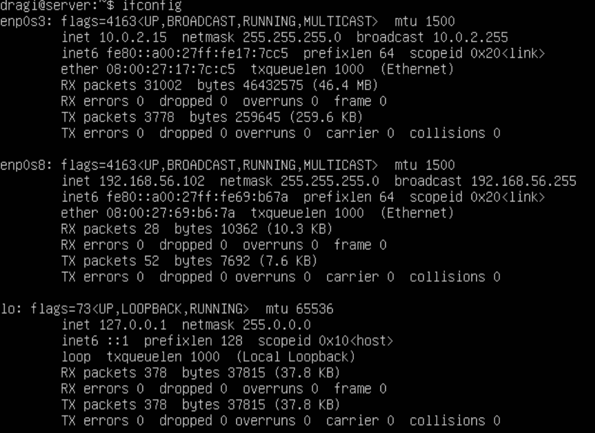
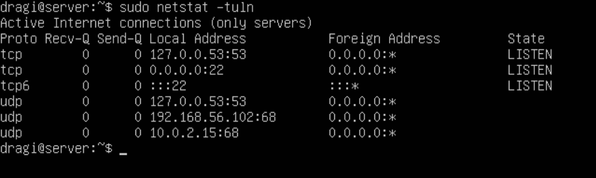
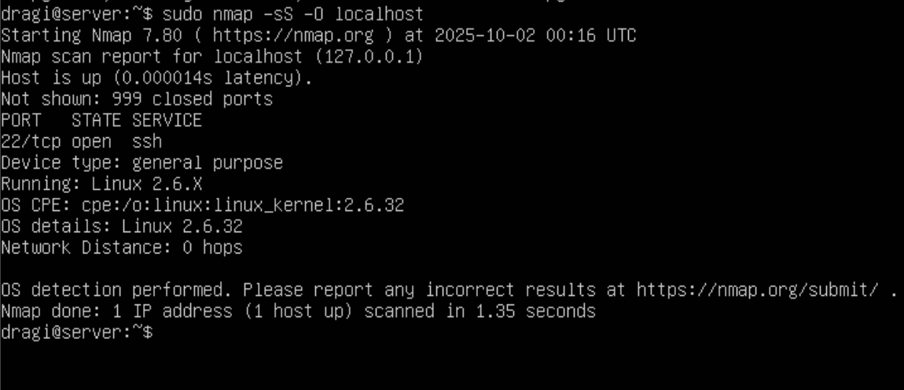
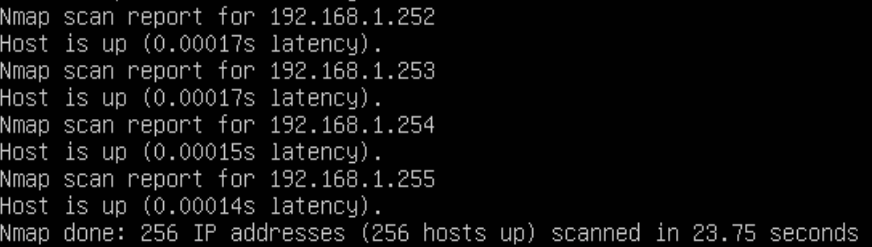
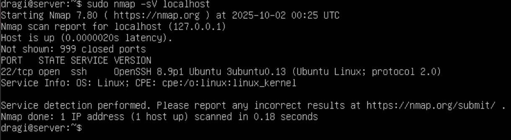
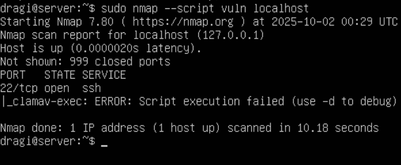
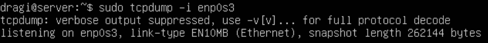
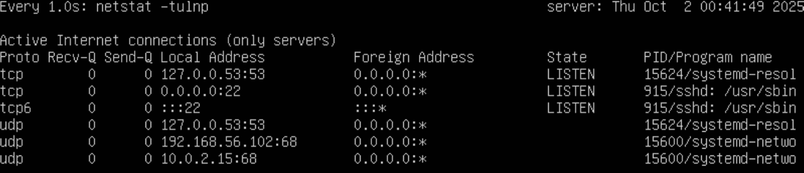
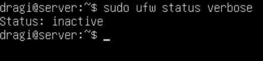

# Ubuntu Home Lab Exploration

## 1. Identify Network Interfaces and IP Addresses

If you run `ifconfig`, you are presented with detailed information about network interfaces, which include but are not limited to, their status, IP addresses, and much more. 

Below is a demonstration of this command being ran on a live Ubuntu server running on a virtual machine.




## 2. Check Open Ports

``` sudo netstat -tuln or ss -tuln ```

This bad boy lists all of the open ports on a server including all the services listening on them. This becomes helpful when you want to identify unnecessary open ports that could be seen as an entry point to attack.




## 3. Analyze Network Connections

` sudo lsof -i -P -n `

The above is a command that lists all the open network connections. This can be useful for identifying unexpected connections to your server. 

For instance, if a bash process was connected outbound on TCP connection, this would be considered unusual. This is because shells ttys and not network sockets. This is called a reverse shell. It is when an attacker's shell is connected back to an external IP address.


## 4. Perform Network Scanning with Nmap

If you want to scan your server to identify open ports, or running services, or even the operating system, you should use:

` sudo nmap -sS -O localhost `

Nmap is a tool that pretty much does that, it scans a server used to discover hosts and services on a network. The `-sS` option is for performing a stealkth TCP SYN scan and `-O` tries to determine the OS.



Note: Utilizing Nmap on a private network without permission can result in legal consequences. Please keep this in mind when using this tool and use it on only trusted networks with permission.

## 5. Check for Open Ports on the Server's Network

Whenever you want to identify all the live hosts on your local network, you can use

` sudo nmap -sP 192.168.1.0/24`

This will help you understand the devices in your network and ensure that there are no suprised devices connected you were not privy to.



The `-sP` portion of the command in Nmap is a "Ping Scan." This discovers which hosts on a network are up without performing a port scan. 


## 6. Check for Services and Versions

If you want to scan for open ports and attempt to determine a service and version running on each of them, you can use:

` sudo nmap -sV localhost `



`-sV` essentially enables version detection and provides a detailed list of the services running on each open port. 


## 7. Identify Potential Vulnerabilities

`sudo nmap --script vuln localhost`

Running the above command will scan scripts to find known vulnerabilities on a server. Extremely useful for finding security vulnerabliities in installed software. 




## 8. Inspect Network Traffic

`sudo tcpdump -i enp0s3`

Whenever you want to check what network traffic is happening around you, use the above command. 

Excellent for detecting suspicious activities and anomalies inside a network in real-time.

`tcpdump` is a packet analyzer. It captures and shows the packet headers of network traffic going through a specified interface. 



Notice: if this interface is not the being found. Do `ip link show` and this will display all of your network interfaces avaliable. 


## 9. Monitor Network Connections in Real-Time

Monitoring continous connections on a network can be done by using the command:

`sudo watch -n 1 netstat -tulnp`

This command allows us to observe in real-time the activities in a network. For example, a new connection or service beginning. 




## 10. Check Firewall Rules

If you want to check what rules a firewall is set to, run: 

`sudo ufw status verbose`



Using this tool can aid in tshowing pich ports and services are allowed or blocked in a server.

`ufw` stands for 'uncomplicated firewall.'

Note: The image is stating that there is no firewall setup. This will be changed in a later chapter.