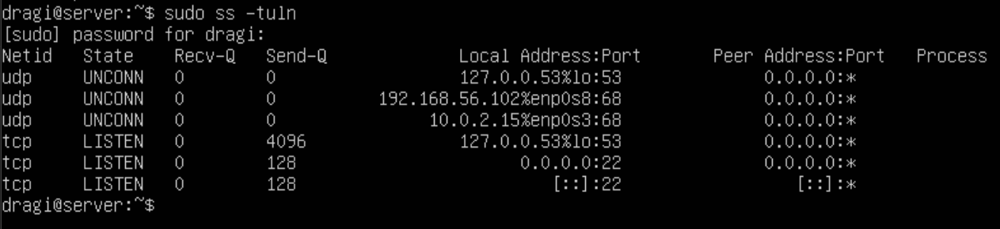

# Setting Up Firewalls

## 1. Enabling UFW

Recall: `UFW = Uncomplicated Firewall`

There are some default Policies when it comes to UFWs.

- Incoming: Denied by default
- Outgoing: Allowed by default

First, we will check the status of UFW. This was done in the end of last chapter. 

Before enabling, however, we want to make sure that the connection to SSH is allowed using the following:

`sudo ufw allow 22/tcp`

Now we can connect via SSH. 

Q: If you are remotely accessing your server, why is it important to allow
traffic through port `22` before enabling UFW?

A: You will lose access to your server remotely since it is not configured to allow this by default.

We need to check the other ports that are open that we may need to allow through, i.e. `80`, `443`, etc.

` sudo ss -tuln ` 

Enable UFW: `sudo ufw enable`

Check the status: `sudo ufw status`

Q: Let’s say a server is a web server. Which ports should be allowed through in
UFW? Once you know, allow the port(s) access.

A: `sudo ufw allow 22/tcp`

`sudo ufw allow 80/tcp`

`sudo ufw allow 443/tcp`

'

Notice how the verbose command displays a more detailed status of the UFW.

Q: Say you have a disgruntled ex employee who is known to wreck havoc. You want to
block his ip address, `10.0.0.0`, from your server using UFW. How would you do this?

A: If your smelly ex employee is trying to wreck havoc on the production server, we can block their ip by doing: `sudo ufw deny from 10.0.0.0`. This will effectively deny all traffic from their ip. 

Q: Say you want to allow `192.168.1.50` access to port `587`. What is the command to allow this in UFW? What is port `587` typically used for?

A: We want to allow ip `192.168.1.50` connection to the port `587`. To do so, we run: `sudo ufw allow from 192.168.1.50 to any port 587`. Port `587` is used primaily for standord SMTP (Simple Mail Transfer Protocol) with message submission. Used by email clients to send mail via internet.

## 2. Enable UFW Logging

To enable logging, we run: 
`sudo ufw logging on`

We will modify this so we can make logging more verbose to really see what is going on.

`sudo ufw logging high`

A typical UFW log entry might look like the following:

`Oct 1 12:34:56 hostname kernel: [12345.67890] [UFW BLOCK] IN=eth0 OUT=
MAC=aa:bb:cc:dd:ee:ff SRC=192.168.1.100 DST=192.168.1.50 LEN=60 TOS=0x00
PREC=0x00 TTL=64 ID=54321 DF PROTO=TCP SPT=12345 DPT=80 WINDOW=14600 RES=0x00
SYN URGP=0`

Let’s break this down:
- MAC: `Source MAC address of the traffic - MAC=aa:bb:cc:dd:ee:ff`
- SRC: `Source IP address of the traffic - SRC=192.168.1.100`
- DST: `Destination IP address - DST=192.168.1.50`
- SPT: `Source port - SPT=12345`
- DPT: `Destination port - DPT=80`
- PROTO: `Protocol used (e.g., TCP, UDP) - PROTO=TCP`
- [UFW BLOCK]: `Indicates that the packet was blocked by UFW.`

Q: Why is this information useful to us?

A: The information above is very useful to us in the sense of network monitoring, security, and troubleshooting. 

#
The following command is used to view logs in the VM: 

`sudo tail -f /var/log/ufw.log`

Logs are stored inside the path `/var/log/ufw.log` and the `-f` option allows us to monitor the log in real time.

To filter specfic entries, use: 

- `sudo grep 'DENY' /var/log/ufw.log` (Deny traffic) 
- `sudo grep 'ALLOW' /var/log/ufw.log` (Allowed traffic)

Q: Is there any output for DENY? Why or why not?

A: It pretty much depends whether any packets are actually blocked by the UFW. If all incoming connections are allowed then there will be no deny entries. But, if you had a service trying to connect to a port not allowed by the UFW configuration, then there will be an deny entry for that port that was accessed. 