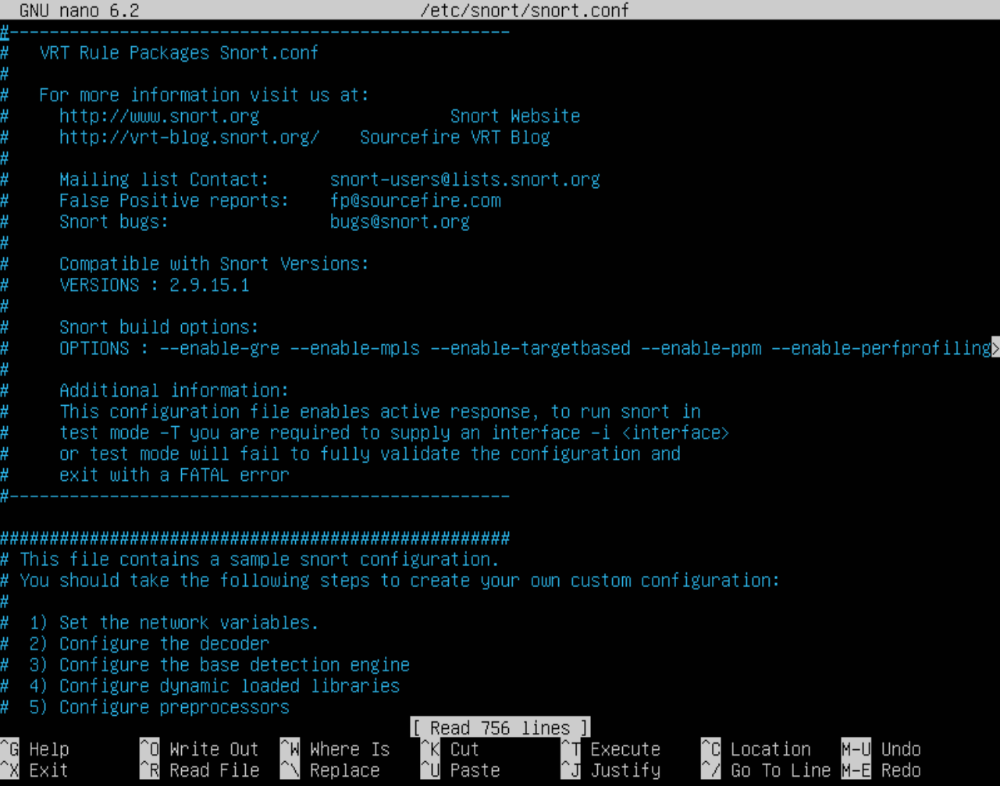
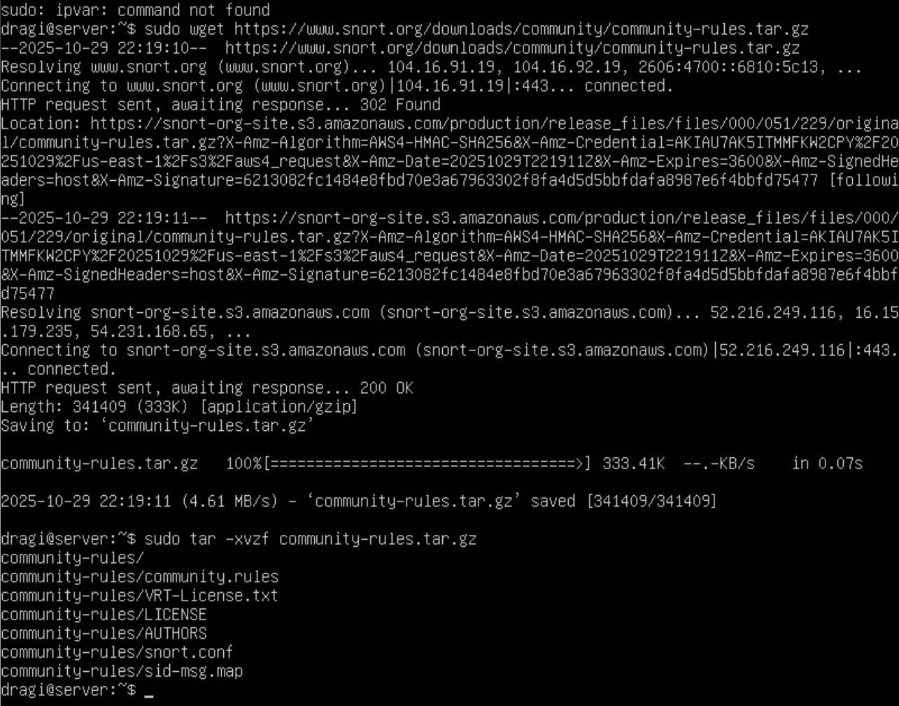
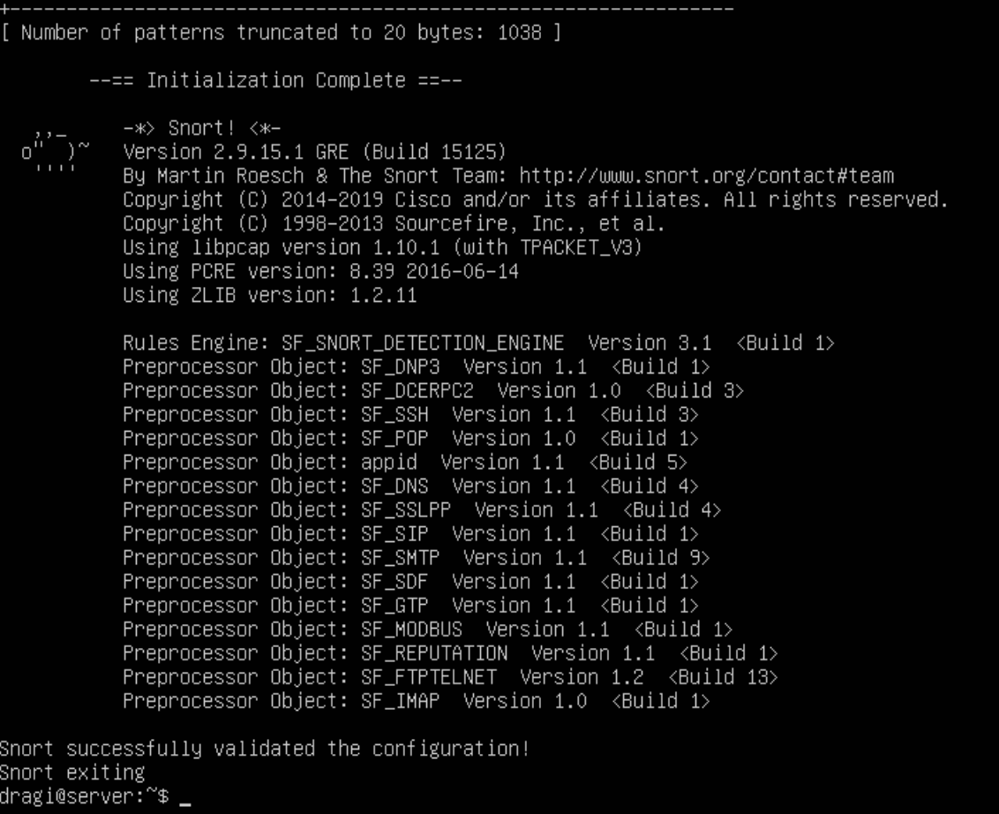
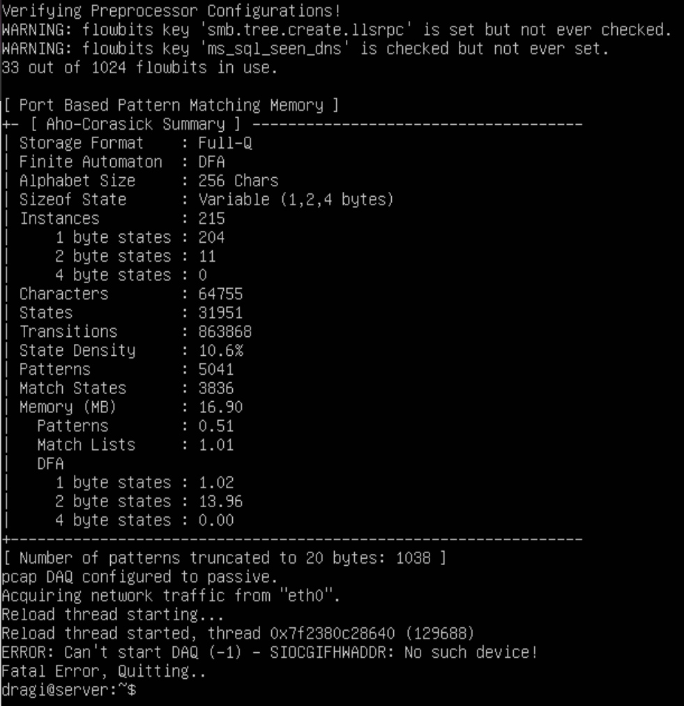
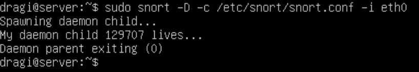

# Messing with Snort      

## 1. Installation

To begin, snort is a network security tool that essentially monitors, detects, and prevents malicious activity on a network.

In order to install it, we will run the following command in our server:

`sudo apt install snort`

After going through the simple installation process, we then can see our network interface by running: `ip a`

## 2. Configuring Snort

Now that we have snort successfully installed onto our server. Lets configure our snort tool in our server. 

Run the following command to access the configuration file: `sudo nano /etc/snort/snort.conf`

Inside this file, we can do several things. But we will focus on one aspect for now. 

HOME_NET: "Ensure it matches your network setup. You can adjust the `ipvar` `HOME_NET` if needed." `ipvar HOME_NET 192.168.1.0/24`

Above, downloaded a tar file from the official snort website using: `sudo wget https://www.snort.org/downloads/community/commnunity-rules.tar.gz`

Then extracted using: `sudo tar -xvzf community-rules.tar.gz`

If you want to add custom personal rules, you can manually edit the local file:
`sudo nano /etc/snort/rules/local.rules`  

Then add custom rules if you desire.

## 4. Test Snort Configuration

After we have configured our tool, we need to test if it is working properly. 

`sudo snort -T -c /etc/snort/snort.conf`

Something like this should be at the end of the console.

As you can see above, it states it was a successful test. 

## 5. Running Snort in IDS Mode

IDS Mode is to monitor traffic, like we stated in the beginning what snort was used for. 

You must specfiy the interface to monitor (e.g. `eth0`, `enX0`, etc.)

`sudo snort -c /etc/snort/snort.conf -i eth0`

## 6: Viewing Snort Logs

Logs can be accessed inside the `var/log/snort` directory. 

Q: What files did you find here? 

A: The `alert` file is one example of many in this directory. It contains snort generated alerts when packets matched a rule that is set. Another example is timestamp logs and other more complex logs as well. 

Q: Do any of them contain content? Why or why not? 

A: Yes and no! It depends whether or not any rules were matched from a scan on the network. If there was something that is bad, then it would pop up as an alert in the log file, otherwise, it will be empty. 

## 7: Running Snort as a Daemon

To run snort in the background as a daemon, use the following command:
`sudo snort -D -c /etc/snort/snort.conf -i eth0`

Not entirely sure if this is what is supposed to happen. But it seems like it somewhat worked.

Q: If you wanted to stop the snort process from running, what is the command to terminate it?

A: `kill (process ID)` or stop all at once with `sudo pkill snort`
