# Building Lightweight SIEM and IDPS

## 1. Setup

Today, we will go through the core components of a modern SIEM and IDPS, install and configure Suricata, configure Promtail and send logs to Loki, query and correlate alerts using LogCLI,
and lastly reflect on the detection pipelin and incidient-response concepts.

### Suricata -- IPS

The purpose of this chapter is to understand an open-source intrusion detection and prevention system that inspects packets and emits alerts. 

The documentation of this technology can be found here:
[https://suricata.io/documentation/
]

### Loki -- Log Database

This is a lightweight log aggregation system. It simply stores logs with helpful labels instead of indicies. 

Loki is our "SIEM-like" backend by centralizing and indexing log data for searching and correlation. 

### Promtail -- Log Shipper

Small agent that tails log files and sends them to Loki  (our backend).

### LogCLI -- Query Tool

Command-line client for Loki queries, helpful for runnning searches, extracting JSON fields, and performing quick analyses. 

### Docker -- Container Platform

Docker is a lightweight virtualization platform that lets you run apps in isolated containers. Essential for allowing multiple developers run tests in development with the exact same environment. 

## 2. Preparing the System

To start, make sure `curl`, `jq`, `unzip`, and `docker` are installed. 

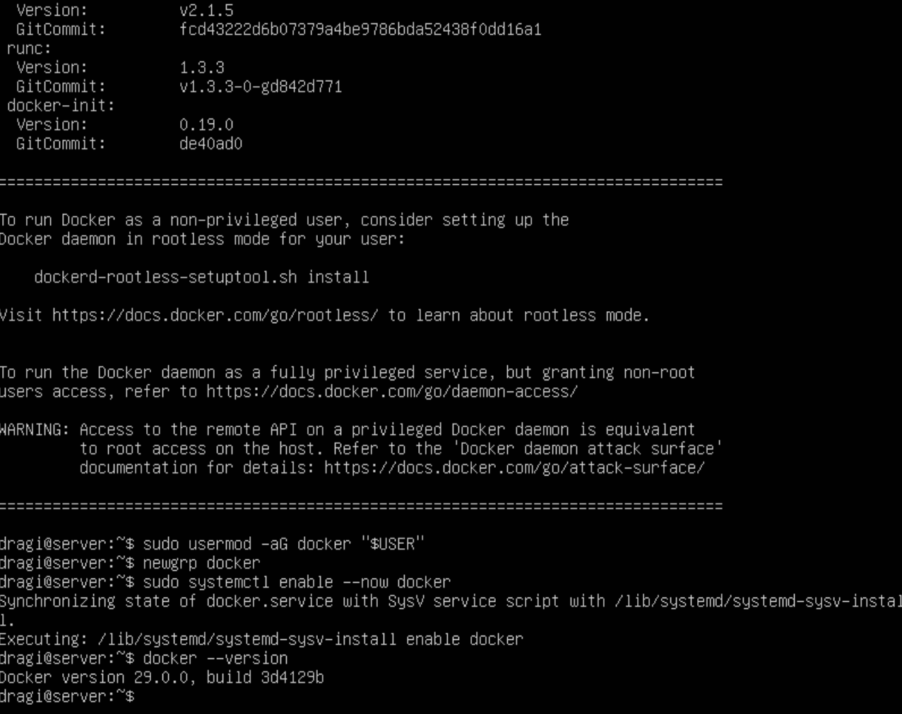

Next, we introduce Suricata. Suricata is a high performance network IDS, IPS, and Network Security Monitoring engine. 

You may ask, what is the difference between Suricata and Snort, which is another major open-source network intrusion detection systems.

Even though both analyze network traffic to detect suspicious activity using rule-based detection, Suricata, is known for its multithreaded performance. It is essentially faster and more scalable for high-traffic networks. 

The best tool? Depends on the specfic network needs and hardware resources. 

Lets begin creating custom rules. First, we need to make sure Suricata has a valid set of default rules and the correct file paths configured. 

This setup essentially prevents startup errors by downloading the community rule set, creating a local rules file, and aligning Suricata's config so it can load and apply both sets of rules successfully. 

`sudo apt -y install suricata`
`sudo apt -y install suricata-update`
`sudo suricata-update`

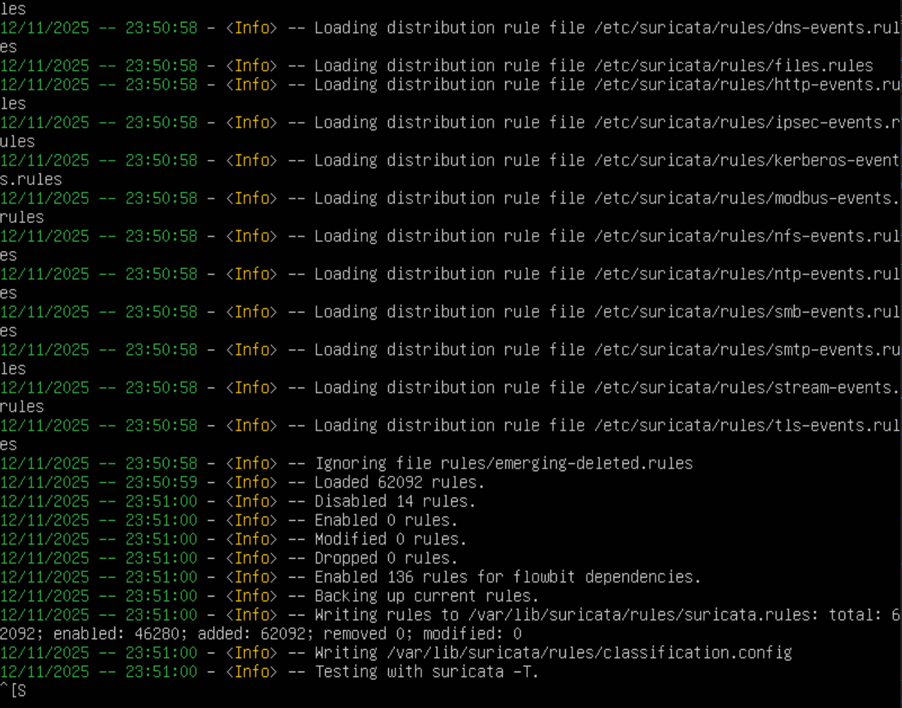

Once all was installed and updated, lets see `/var/lib/suricata/rules/suricata.rules`

It is the main ruleset file that gets downloaded and managed by the Suricata Update utility, containing thousands of prewritten signatures for the following. Exploit attempts, malware traffic, network scans, common vulnerabilities, and suspicious protocols or payloads. 

We will also need our interface name. Run `ip -br a | awk '$1!="lo"{print $1, $3}` to find it. 

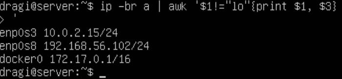

Now we create a directory and file for our custom rules:

`sudo mkdir -p /etc/suricata/rules`
`sudo touch /etc/suricata/rules/local.rules`

Update the suricata.yaml file to the correct rule path by running `sudo nano /etc/suricata/suricata.yaml` and pressing control + w to search for `default-rule-path`.

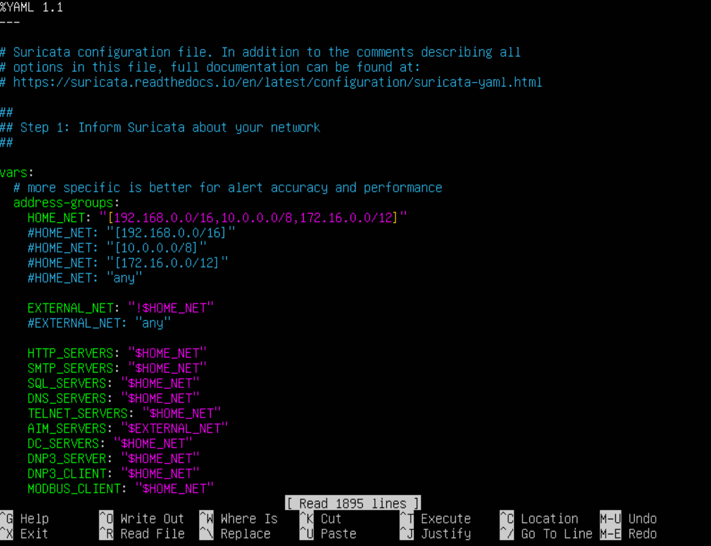

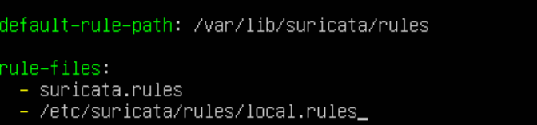

Then, search for `af-packet` and replace that value with the interface name from previously. 

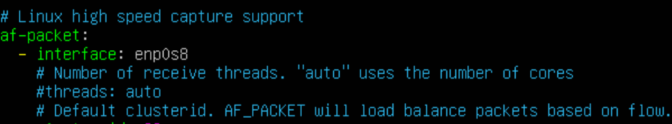

We may test our suricata connection by running: `sudo suricata -T -c /etc/suricata/suricata.yaml -v`

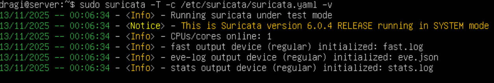

`-T` runs Suricata in test mode. This basically means it checks the config file for syntax or logical errors without actually starting packet capture or detection. 

`-c /etc/suricata/suricata.yaml` specifies the config file to use. 

`-v` enables verbose output. Suricata prints detailed messages to the console during the test, but this addon helps you see what's being loaded and quickly identify here any config issues occur. 

Let's finally run Suricata!

`sudo systemctl stop suricata`
`sudo suricata -i $(ip -br a | awk '$1!="lo"{print $1; exit}') -D`

Confirm it writes logs: `sudo tail -f /var/log/suricata/eve.json | jq`

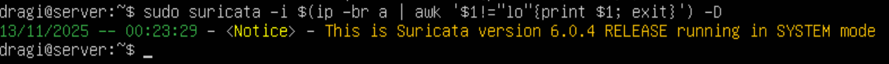

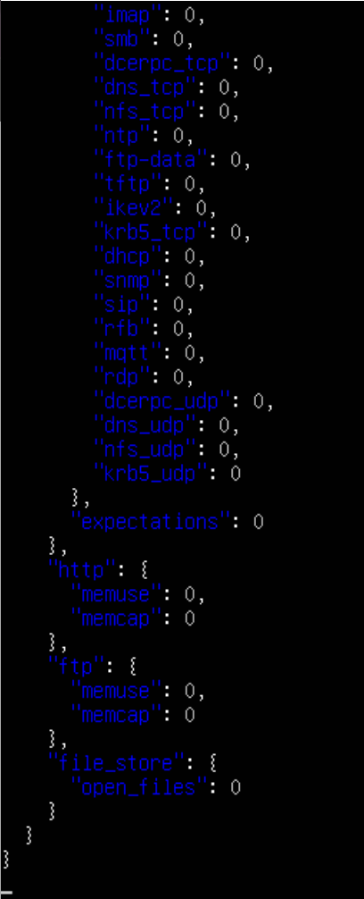

As you can see, it displays a lot of json. 

Q: What types of events (fields under `event_type`) do you see in eve.json? 

A: From what we can see, there are event types that say: alert, flow, dns, http, fileinfo, ftp, smtp, stats, and more. 

## 3. Loki

Loki acts as the central log database in the SIEM setup. 

We use it to store Suricata's network and alert logs, as well as enable fast searching and filtering, and demonstarting how a SIEM collets and analyzes security events. 

Lets setup Loki. `sudo mkdir -p /etc/loki /var/lib/loki/{chunks,rules}`

Create a default Loki config file:

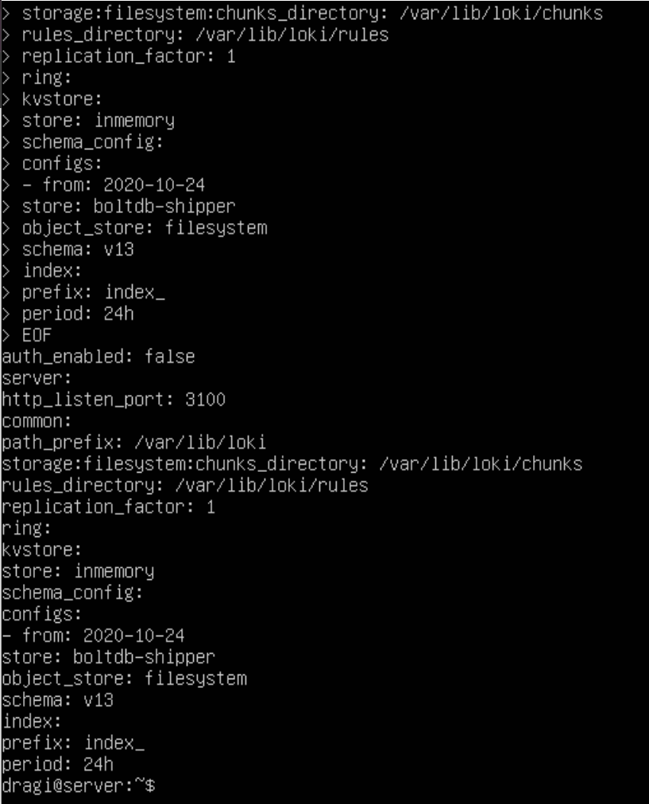

Fix the permissions so Loki can write data and permission to write to `/var/lib/loki`

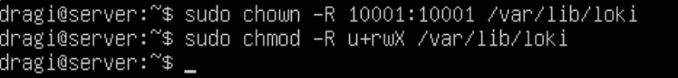

Once that is setup, we can run Loki in Docker.

`sudo docker run -d --name loki -p 3100:3100 \ -v /etc/loki:/etc/loki \ -v /var/lib/loki:/var/lib/loki \ grafana/loki:2.9.8 -config.file=/etc/loki/loki-config.yml`

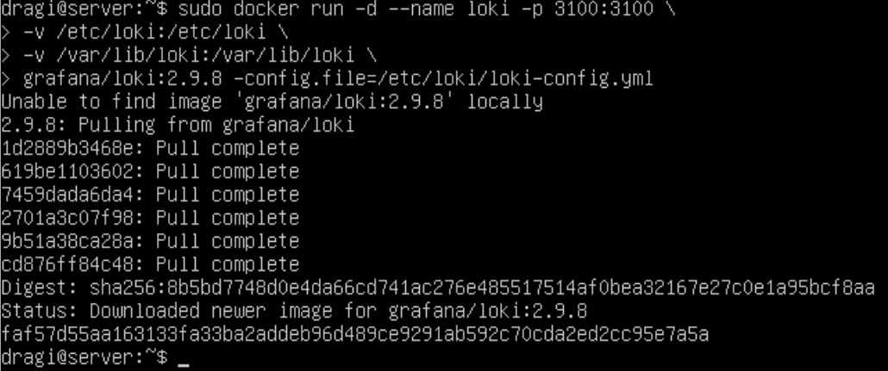

Q: What port does Loki expose, and what API path receives log data?

A: Loki exposes port 3100 by default and the endpoint that recieves log data is `/loki/api/v1/push`. 

## 4. Run Promtail

Promtail is an agent that collects logs from a system and sends them to Loki. 

Note: Promtail is deprecated and will be EOL March 2026. 

First, lets create Promtail folders:

`sudo mkdir -p /etc/promtail /var/lib/promtail`

Write the Promtail config file:

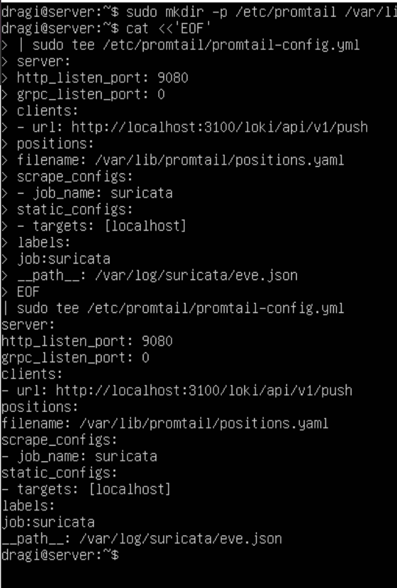

Run the Promtail container:

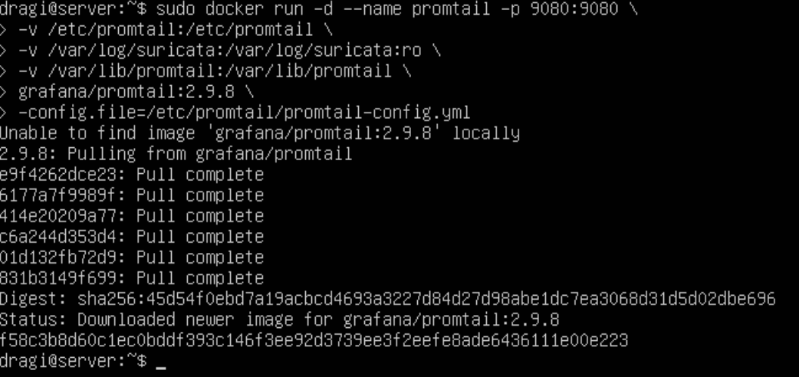

Q: What roles does Promtail play compared to Loki?

A: Log collector and shipper, while Loki is the log aggregator and storage system.

Q: Why does Promtail track a “position file”? What problem does it solve?

A: To remember how far it has read in each log file. The problem this solves is the problem of duplicate or missing log entries when Promtail restarts or system reboots potentially. Without Loki, Promtail would have to start reading every log file from the beginning and resending the old logs to Loki. 

## 5. Install Log CLI and Test Queries

LogCLI is Granfana Loki's command line tool to query, view, and analyze logs directly from the terminal. 

Download and install LogCLI: `curl -L https://github.com/grafana/loki/releases/download/v2.9.8/logclilinux-arm64.zip -o /tmp/logcli.zip`

What this does:
`curl -L ... -o /tmp/logcli.zip` downloads the LogCLI tool and saves it as `/tmp/logcli.zip`. The -L flag tells curl to follow the redirects. 

`sudo unzip -o /tmp/logcli.zip -d /usr/local/bin` unzips the zip file we just downloaded. 

`sudo mv /usr/local/bin/logcli-linux-arm64 /usr/local/bin/logcli` renames the extracted binary to simply logcli for easier use in the terminal.

`sudo chmod +x /usr/local/bin/logcli` makes the `logcli` binary executable as it is not given permission automatically. 

`logcli --version` checks the version is correctly there. 

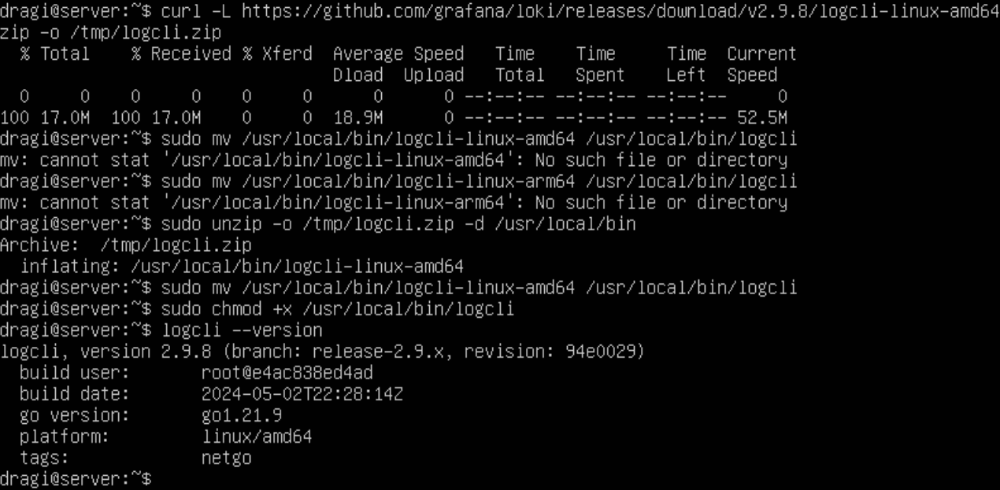

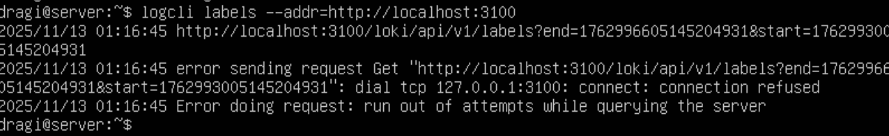

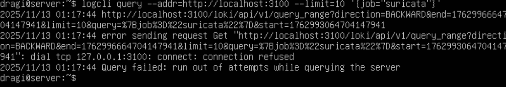

Q: What labels do you see attached to your logs?

A: `job="suricata"`, `host`, `__path__`, `level`, `facility`

Q: How do labels differ from full-text indexes?

A: Labels are key-value pairs attached to logs and used for efficient filtering and grouping before querying the actual log content. Whereas, full-text indexes index the entire content of log lines and allow searching aribitary words or patterns anywhere in the log messages. 

## 6. Generate Alerts and Analyze

Lets test this now: `echo 'alert http any any -> any any (msg:"LAB UA hit"; http.user_agent;content:"CPS-NETSEC-LAB"; sid:9900001; rev:1;)' \ | sudo tee -a /etc/suricata/rules/local.rules`

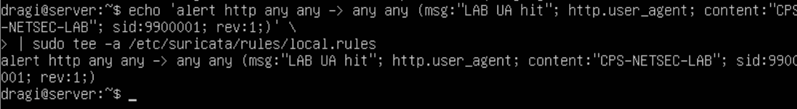

Restart Suricata to load the new rule: `sudo systemctl restart suricata`

Trigger the alert: `curl -A "CPS-NETSEC-LAB" http://example.com/ || true`

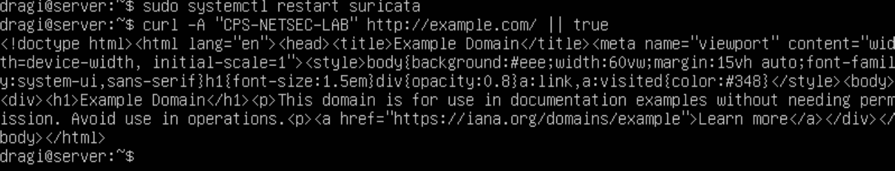

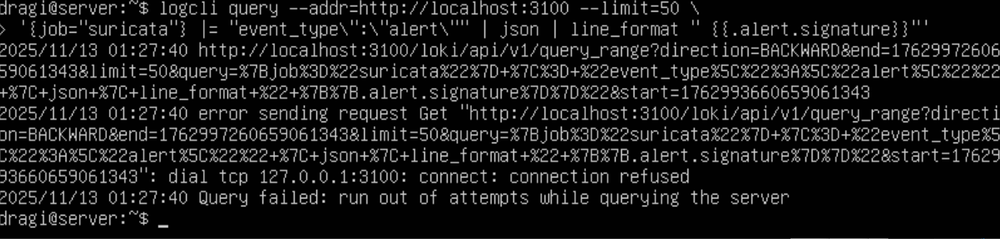

Q: What is the command above doing?

A: This command basically fetches up to 50 suricata alert logs from Loki and prints just the alert signature names in a clean list. 

Q: An example is `ET POLICY Suspicious inbound to MSSQL port 1433` which is a policy alert for potential attacks. 

## 7. Correlation Challenge

Q: What does this simple command illustrate about correlation and aggregation in
SIEMs?

A: It shows how SIEMs turn raw logs into actionable insights by aggregating and correlating repeated events across time and sources. 

Q: How might a SOC use this information in an investigation?

A: It can be used to detect patterns, prioritize threats, and respond efficiently. 

## 8. Create and Test a Custom Rule

We can run this: `alert http any any -> any any (msg:"HTTP access to /admin detected"; content:"/admin"; http_uri; sid:100001; rev:1;)`

Then test it using curl: `curl http://localhost/admin tail -f /var/log/suricata/eve.json`

Then query it using Loki: `logcli query --addr=http://localhost:3100 --limit=10 '{job="suricata"} |= "event_type\":\"alert\"" | json | line_format "{{.alert.signature}}"'`

There will be a `HTTP access to /admin detected` alert.

Q: What condition did your rule detect?

A: It detected HTTP requests containing /admin in the URL. This indicated someone probing admin pages without permission.

Q: How did you test and confirm that it triggered correctly?

A: We tested this by running the curl command and verified that the alert appeared in eve.json and in Loki using `logcli`.

Q: How would you modify your rule to make it more specific (to reduce false positives)?

A: We can use regex to avoid partial matches.

Q: Why is fine-tuning rules important in real-world intrusion detection?

A: It reduces false positives and also improves accurancy and performance by avoiding unnecessary processing. It helps with detecting actual threats quickly wihtout being overwhelmed by unwanted traffic. 

## 9. Clean Up

Now that we are done, we can remove the docker containers!

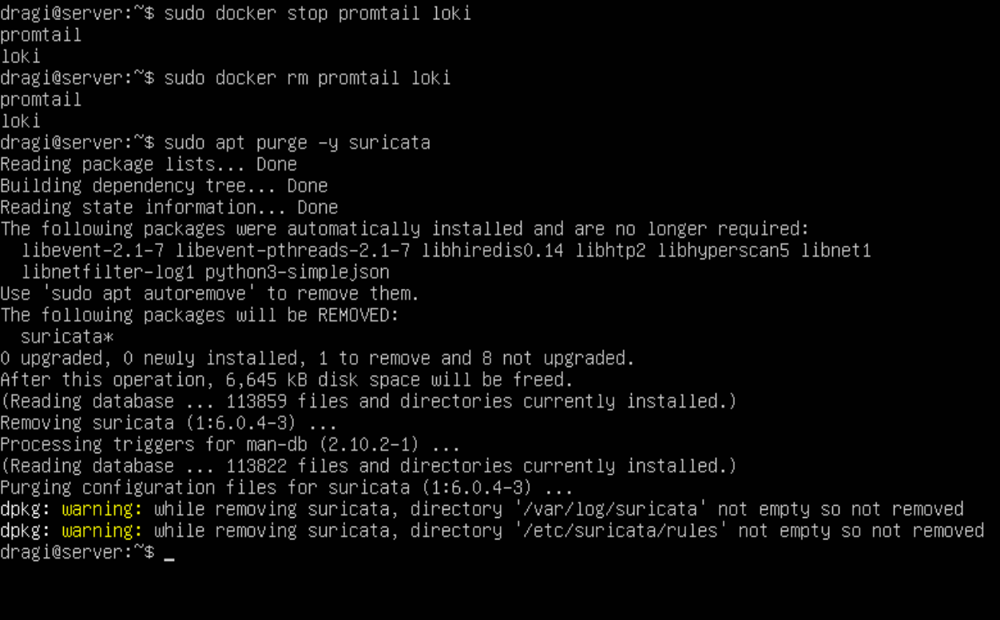

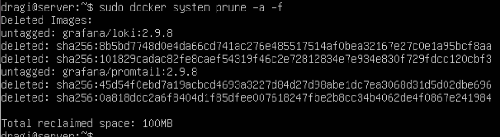

What did we learn after this? 

We guided ourselves through setting up a lightweight SIEM and IDPS using Suricata, Loki, Promtail, and LogCLI. This benefitted us by learning how to create and test custom detection rules, ship logs to a centralized database, and query alerts for actionable insights. Overall, it showed the core concepts of intrusion detection, log aggregation, and security event analysis first hand! 